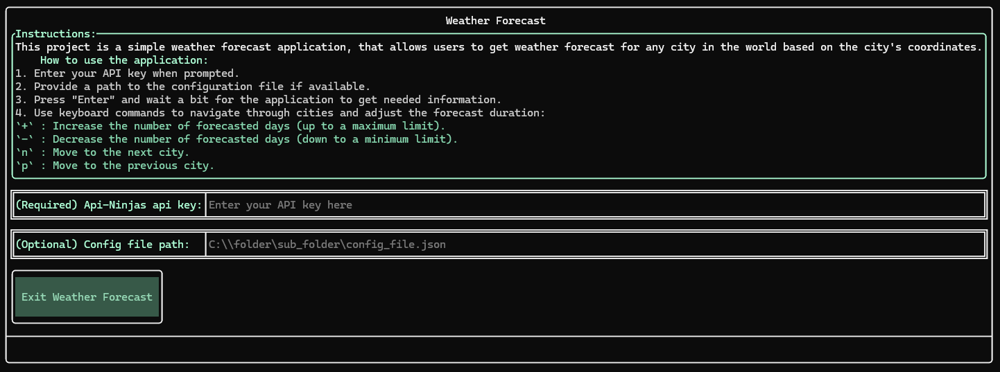
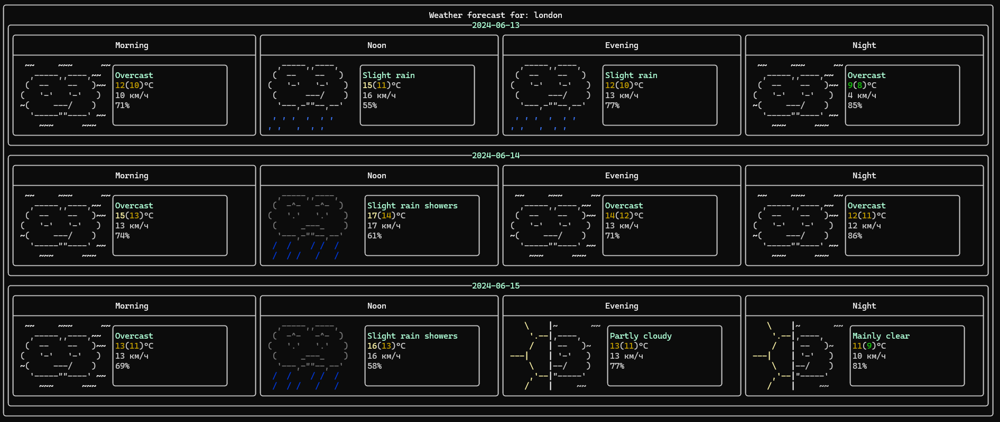
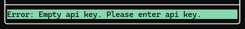

# Weather Forecast Terminal Application
This project is a simple weather forecast application, that allows users to get weather forecast for any city in the world (up to 16 days of info), using [C++ Requests](https://github.com/libcpr/cpr) library for [HTTP-Requests](https://en.wikipedia.org/wiki/HTTP), [JSON for Modern C++](https://github.com/nlohmann/json) library for .json files and [ftxui](https://github.com/ArthurSonzogni/FTXUI) library for UI. It utilises [Open-Meteo](https://open-meteo.com/en/docs#latitude=59.94&longitude=30.31&hourly=temperature_2m&forecast_days=16) for the forecast data and [API-Ninjas](https://api-ninjas.com/api/city) for the city coordinates based on it's name, provided in .json file (by default it's lib/cfg.json, but it can be changed directly in the application).

## Features

- **User Input**: Allows users to input their API key and an optional configuration file path.
- **Weather Forecasts**: Displays detailed weather forecasts for selected cities.
- **Daytime Segmentation**: Provides forecasts for different times of the day, including morning, noon, evening, and night.
- **Navigation**: Enables users to navigate through different cities and adjust the number of forecasted days using simple keyboard commands.
- **Visual Representations**: Uses ASCII art to visually represent various weather conditions.
- **Weather Parameters**: Displays key weather parameters such as temperature, wind speed, and humidity for different times of the day.

## Getting Started
1. **Integrate library into your project**: Inlcude the [Forecast.hpp](lib/Forecast.hpp) file in lib folder and use method 'Start' to start the application.
```cpp
#include "../lib/Forecast.hpp"

int main() {
    Forecast forecast;
    forecast.Start();
}
```
2. **Input API Key**: Enter your API key when prompted (You can find your API key at [API-Ninjas/Profile](https://api-ninjas.com/profile) section).
3. **Optional Configuration**: Provide a path to the configuration file if needed (by default it's [lib/cfg.json](lib/cfg.json)).

4. **View Forecasts**: Use the application to view weather forecasts for selected cities.
5. **Navigate**: Use [keyboard commands](#keyboard-commands) to navigate through cities and adjust the forecast duration.

6. **View Errors**: Any errors will be shown in the main application screen. An example is shown below.

    

## Keyboard Commands

- `+` : Increase the number of forecasted days (up to a maximum limit of 16).
- `-` : Decrease the number of forecasted days (down to a minimum limit of 1).
- `n` : Move to the next city.
- `p` : Move to the previous city.
- `Esc` : Exit the application.

## Dependencies

- [FTXUI](https://github.com/ArthurSonzogni/FTXUI): A simple and modern C++ library for terminal-based user interfaces.
- [C++ Requests](https://github.com/libcpr/cpr): A library for [HTTP-Requests](https://en.wikipedia.org/wiki/HTTP).
- [JSON for Modern C++](https://github.com/nlohmann/json): A modern library for working with .json files.

## Issues And Contributions
For any issues or contributions, please open an issue or pull request on the project's GitHub repository.

## License

This project is licensed under the MIT License. See the [LICENSE](LICENSE.txt) file for details.

© 2024 Weather Forecast Terminal Application Project. All rights reserved.
